# Wikimedia microtask for Outreachy

### Project: Analyze community authored functions that build Wikipedia infoboxes and more

## Microtask: [T263678](https://phabricator.wikimedia.org/T263678)

- To write a script that fetches all of the source code on English Wikipedia in Namespace Module. [extract_source.py](extract_source.py)
- Generate a summary of statistical analysis of the obtained data. 

### Obtaining data

First API calls are made to create a dataframe containing information and source code of all the files from namespace module, which is exported as a csv file. 

A snapshot of the dataframe is given below:
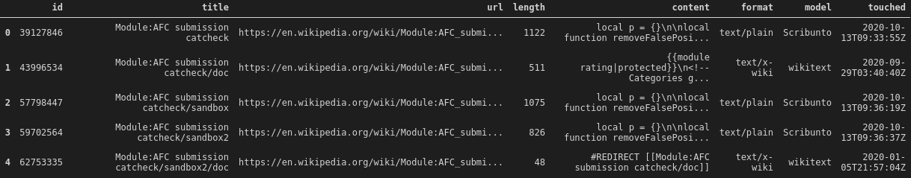

All code for the analysis are present in [dev.ipynb](dev.ipynb). Below I describe some of the results concluded from the analysis in brief.

NB: All images shown here are interactive in dev.ipynb. You can zoom in-out, toggle legends entries etc.

### Some basic information
- Number of files: 12507
- Number of unique modules: 850
- Number of file formats: 4

### File formats
There are 4 kinds of file formats with two dominating types.

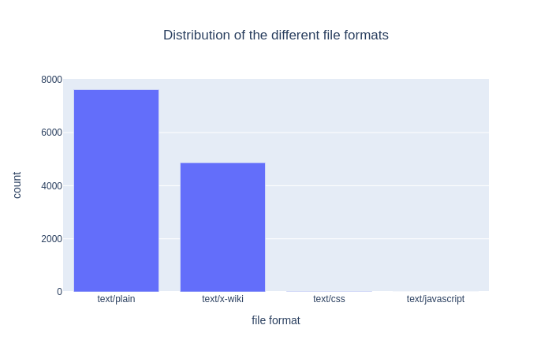

### Modules
Each file name is trimmed accordingly to extract the module names. There are 850 unique modules. Some modules have lots of files while others don't. Distribution of top 10 modules is shown below.

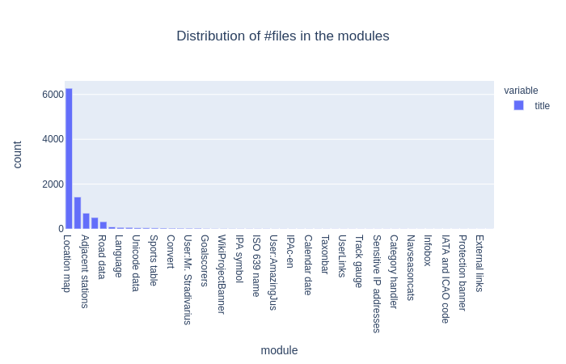

### Page titles

Some pages have distinct titles that can be separated into groups. One of them is pages starting with `User:` such as `User:Mr. Stradivarius`, `User:AmazingJus`, `User:DePiep`. There are  97 such pages with 25 unique pages.

Most pages have some suffixes attached such as `example/doc`, `example/sandbox` etc. Some of the major groups are:
| suffix? | name | #of pages | #of unique 
| ---|---|---|---
| No suffix | | 819 | 819
|  | docs | 4849 | 4078
|  | sandbox | 724 | 260
| Suffix | testcases | 208 | 59
|  | data | 3638 | 3577
|  | remaining | 5907 | 7778

Below the distribution of each of these suffixes is shown:

| docs | sandbox | testcases | data | remaining |
| ---  | ------- | --------- | ---- | --------- |
| 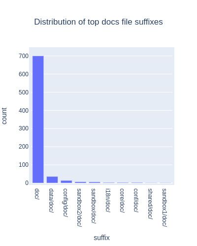 | 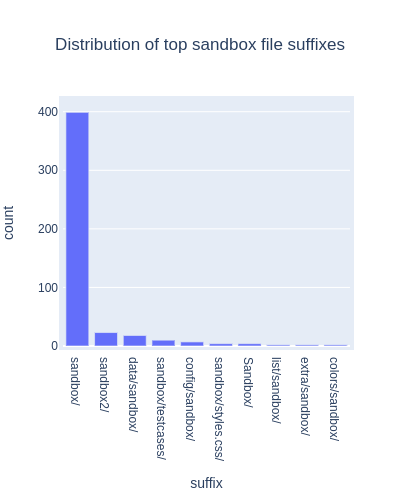 | 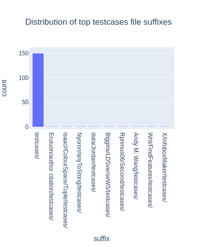 | 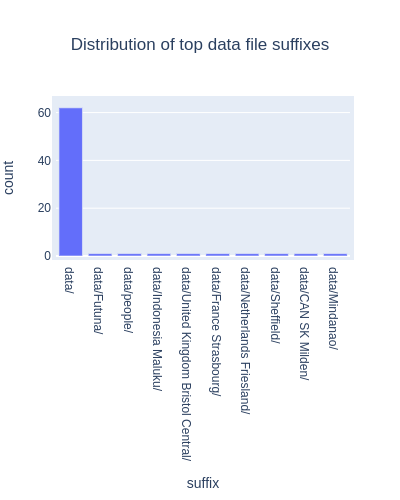 | 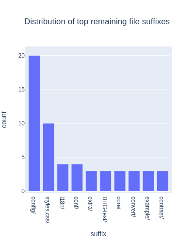 |

### File size

A histogram of file sizes (denoted by length) is shown below. Because most files small, only files of sizes less than 5000 bytes are shown. Moreover the file formats are also colored separately. Details can be found in dev.ipynb.

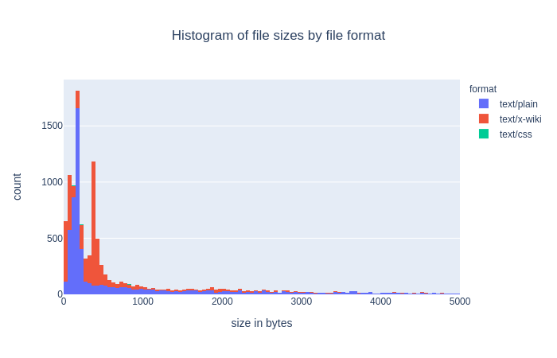

Moreover we can view the correlation of file size and the modules. This plot doesn't show all the module names, but is visible when one zooms in (interactive in ipynb). It is clear that most files are of small size, with exception of a few modules.

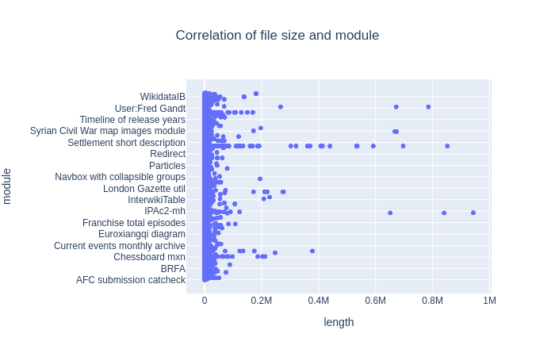

Correlation of file format and file size.

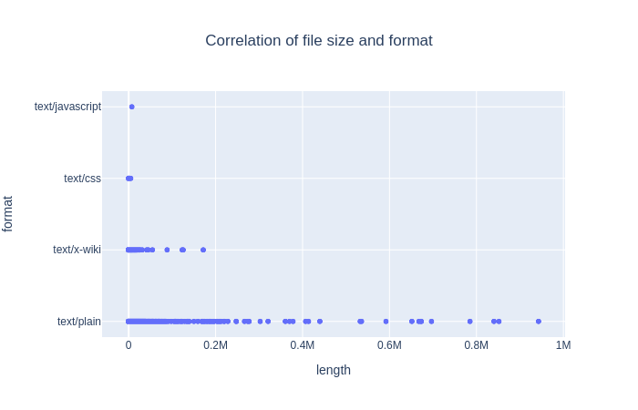

text/plain files seem to come in all sizes whereas text/wiki files are usually small in size.

### Revision

Besides, I also compare modules and formats with the latest revision time. This can give us an idea of how recently are modules revised.

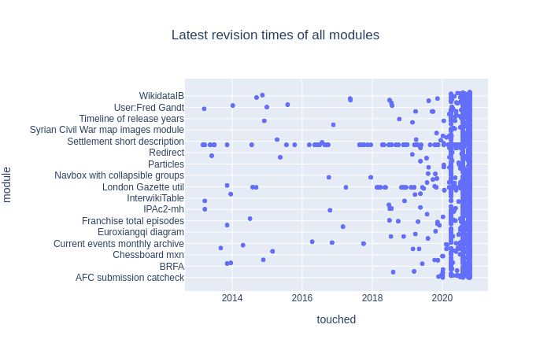

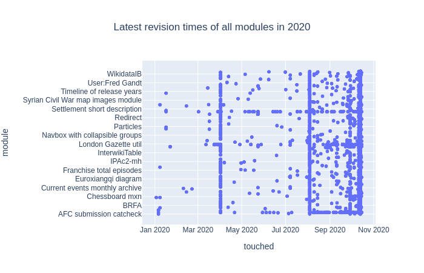

We can see there distint lines, infact zoomin further to see 4-5 lines. These show us that on some days a large number of modules were edited simultaneously. It can be any file for each of the modules.

We can also view what kind of files are revised more in recent dates.

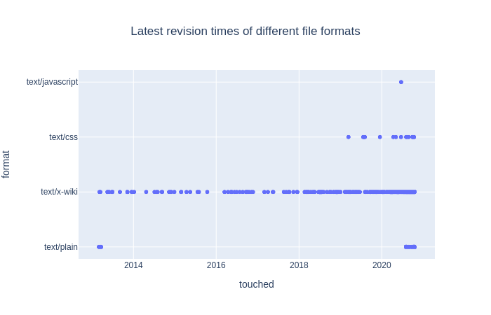

This shows that x-wiki files are not revised often. Some latest revisions date back to 2014. Almost all code files, i.e text/plain files have been revised recently.